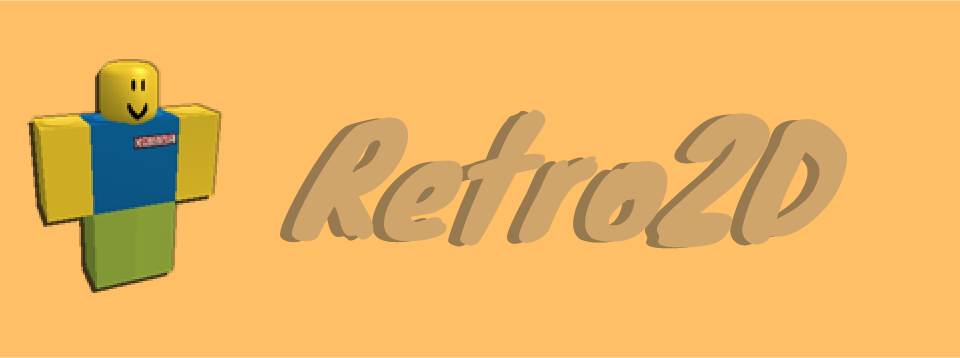

## Hi there 👋
I am Retro2D, a young self-tought coder and thinker.  
I am currently learning Python, web development(JS, CSS, Html), and C/C++.
I also am pretty good at coding in Scratch, you can find me there under the username "Retro2D".
That's all, bye! :-)

<!--
**Retro2D/Retro2D** is a ✨ _special_ ✨ repository because its `README.md` (this file) appears on your GitHub profile.

Here are some ideas to get you started:

- 🔭 I’m currently working on ...
- 🌱 I’m currently learning ...
- 👯 I’m looking to collaborate on ...
- 🤔 I’m looking for help with ...
- 💬 Ask me about ...
- 📫 How to reach me: ...
- 😄 Pronouns: ...
- ⚡ Fun fact: ...
-->
